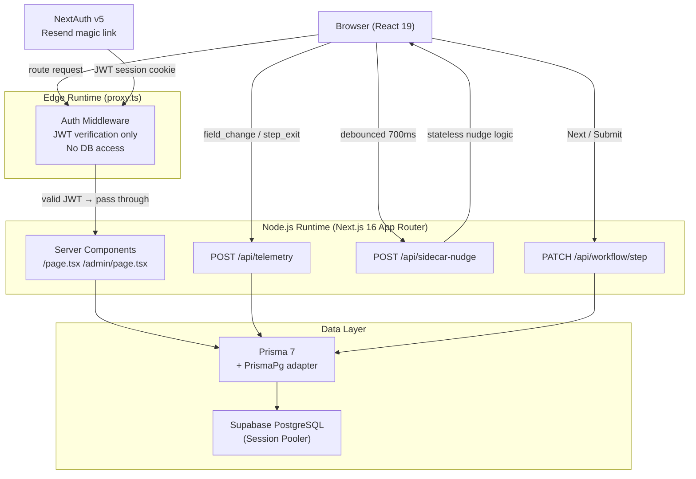

# Covenant Monitor

A loan covenant compliance engine for commercial banking — built as a case study for the **Strive Forward Deploy Engineer** application.

Underwriters process borrower financials through a 4-step guided workflow. Every interaction is instrumented at the FDE level. A COO dashboard surfaces aggregate risk and behavioral patterns across the review pipeline.

**Live demo:** [strive-covenant-monitor.vercel.app](https://strive-covenant-monitor.vercel.app)  
**Admin dashboard:** [/admin](https://strive-covenant-monitor.vercel.app/admin)

---

## Security

### Email Gate (Authentication)

Access is restricted to verified users via **magic-link email authentication** — no passwords are stored.

1. User submits their email at `/auth/signin`
2. **NextAuth v5** generates a short-lived one-time token and sends a click-to-sign-in link via **Resend**
3. Clicking the link verifies the token server-side; NextAuth issues an encrypted **JWT session cookie** (`HttpOnly`, `Secure`, `SameSite=Lax`)
4. `proxy.ts` (Edge Runtime middleware) calls `NextAuth.auth()` on every request — it decrypts and validates the JWT *without touching the database*, redirecting to `/auth/signin` if absent or invalid
5. All protected routes (`/`, `/admin`) are unreachable without a valid JWT

**Why JWT sessions over database sessions:**
The Edge Runtime cannot run Prisma + PostgreSQL. Using `strategy: "jwt"` keeps the auth path at ~0ms database latency. The tradeoff is that individual sessions cannot be revoked before expiry — acceptable for this use case.

**Admin access:**
`/admin` uses the same JWT gate. In production, restrict admin access by checking `session.user.email` against a role stored in the database or an environment-variable allowlist.

---

## Architecture



**Key architectural decisions:**

- `proxy.ts` runs in the edge runtime and only verifies the JWT cookie — it never touches the database. This is required because Prisma + PostgreSQL cannot run at the edge.
- Session strategy is `"jwt"` (not `"database"`) so the edge middleware can verify sessions from an encrypted cookie without a DB round-trip.
- The sidecar nudge API is stateless — it evaluates rules in memory and returns nudge strings with no persistence, keeping latency under 20ms.

---

## Tech Stack

| Layer | Technology |
|---|---|
| Framework | Next.js 16 (App Router) |
| Language | TypeScript 5 |
| Auth | NextAuth v5 beta · Resend magic link |
| ORM | Prisma 7 · `@prisma/adapter-pg` driver adapter |
| Database | Supabase (PostgreSQL, Session Pooler) |
| Styling | Tailwind CSS v4 |
| Charts | Recharts 3 |
| Deploy | Vercel |

---

## Database Schema

### Schema Design Rationale: Relational vs NoSQL

**Recommendation: Relational (PostgreSQL) for transactional data; vector store for ML embeddings.**

The covenant workflow produces two distinct data types with different access patterns:

| Data type | Recommended store | Reason |
|---|---|---|
| `CovenantSession` + `TelemetryEvent` | PostgreSQL (relational) | Strong consistency required — each session has a defined lifecycle (in_progress → completed). Audit trails require immutable, queryable records. Aggregation queries (groupBy, avg, count) are native SQL. |
| Historical decision embeddings (for semantic search) | pgvector or Pinecone | "Find sessions similar to this borrower" is a nearest-neighbor problem, not a JOIN. Embedding the session's financial features + decision outcome enables semantic retrieval for the MCP sidecar. |
| Feature store (ML training) | Columnar store (BigQuery / Redshift) | Batch feature extraction for model training benefits from columnar scan performance, not row-level transactional guarantees. |

A pure NoSQL approach (e.g. MongoDB) would sacrifice the aggregation performance the COO dashboard depends on and add complexity without benefit at this data volume. The hybrid approach — relational for operational data, vector for semantic retrieval — matches each workload to the right engine.

```prisma
model CovenantSession {
  id                String    @id @default(cuid())
  userId            String
  documentType      String?
  borrowerName      String?
  borrowerEmail     String?
  income            Float?
  scanQuality       String?   // "Good" | "Poor"
  totalDebt         Float?
  totalEquity       Float?
  debtToEquityRatio Float?
  decision          String?   // "Approve" | "Flag" | "Reject"
  decisionNotes     String?
  currentStep       Int       @default(1)
  status            String    @default("in_progress")
  createdAt         DateTime  @default(now())
  completedAt       DateTime?
  telemetryEvents   TelemetryEvent[]
}

model TelemetryEvent {
  id                String           @id @default(cuid())
  userId            String
  covenantSessionId String?
  eventType         String           // step_enter | step_exit | field_change | sidecar_shown | decision_made
  step              Int?
  fieldName         String?
  oldValue          String?
  newValue          String?
  timeOnStepMs      Int?
  fieldChangeCount  Int?
  metadata          Json?
  createdAt         DateTime         @default(now())
}
```

Each completed session produces ~9 telemetry events: `step_enter` × 4 + `step_exit` × 4 + `decision_made` × 1. `field_change` events are unbounded — every keystroke is captured with the old and new value.

---

## Workflow (Phase 1)

| Step | Name | Purpose |
|---|---|---|
| 1 | **Ingest** | Classify document type, record borrower info and scan quality |
| 2 | **Validate** | Enter total debt and equity figures from documents |
| 3 | **Analyze** | System computes D/E ratio and surfaces risk level |
| 4 | **Decide** | Underwriter selects Approve / Flag / Reject with notes |

**D/E ratio risk thresholds:**

| Ratio | Risk Level | System Recommendation |
|---|---|---|
| ≤ 1.0 | Low | Approve |
| 1.0 – 2.0 | Moderate | Approve with notes |
| 2.0 – 3.0 | Elevated | Flag for review |
| > 3.0 | High | Reject / executive approval |

Session state is persisted to the database on every step transition via `PATCH /api/workflow/step`. If the user refreshes mid-workflow, their progress is restored from the server.

---

## Sidecar Contextual Feed

A real-time guidance panel appears alongside the workflow form. On every field change, the client debounces 700ms then POSTs current form state to `/api/sidecar-nudge`. The API evaluates rule-based conditions and returns plain-text nudge strings.

Example nudges by step:

- **Step 1:** "Low quality scan — consider requesting a cleaner copy before proceeding."
- **Step 2:** "Large debt exposure (>$5M). Verify against current credit limits."
- **Step 3:** "D/E ratio 3.42 exceeds 3.0 — policy threshold for rejection or executive approval."
- **Step 4:** "Consider adding notes to document your reasoning for audit purposes."

Each sidecar appearance fires a `sidecar_shown` telemetry event, allowing the dashboard to correlate nudge exposure with decision quality over time.

---

## FDE Telemetry Pipeline (Phase 3)

Every user interaction in the workflow is captured as a structured event and written to `TelemetryEvent` in real time.

```
Browser action → fireEvent() → POST /api/telemetry → db.telemetryEvent.create
```

**Event taxonomy:**

| `eventType` | Payload | Used for |
|---|---|---|
| `step_enter` | `step` | Funnel drop-off analysis |
| `step_exit` | `step`, `timeOnStepMs`, `fieldChangeCount` | Time-on-task, revision frequency |
| `field_change` | `fieldName`, `oldValue`, `newValue` | Field error patterns, correction loops |
| `sidecar_shown` | `step` | Nudge exposure rate |
| `decision_made` | `metadata.decision` | Decision attribution |

Telemetry calls are fire-and-forget (`fetch(...).catch(() => {})`). They never block the user interaction and silently fail if the network is unavailable. This design keeps the workflow latency unaffected by telemetry volume.

### Telemetry Schema Rationale

Each event type was chosen to answer a specific product question — not just to log activity:

| Event | Why instrumented | Product question answered |
|---|---|---|
| `step_enter` | Establishes step open time for paired `step_exit` computation | Which steps do users abandon? |
| `step_exit` | Captures `timeOnStepMs` + `fieldChangeCount` per step | Where does friction concentrate? High Step 2 revision count → document quality problem |
| `field_change` | Records every keystroke with `oldValue` → `newValue` | Are users correcting values? Correction loops signal ambiguous source documents |
| `sidecar_shown` | Fires when ≥1 nudge is visible | Does sidecar exposure correlate with better decisions? |
| `insight_button_click` | Fires when user expands an Insight Button | Which contextual benchmarks do users actually consult? |
| `decision_made` | Records the final decision with user ID | Enables cohort analysis: do longer Step 3 dwell times produce better outcomes? |

**Why not just track page views?**
Page views reveal *what* users looked at; these events reveal *how confidently* they moved through the process. `fieldChangeCount` on Step 2 is a behavioral proxy for document legibility — it is the kind of signal that a rule-based sidecar can surface immediately and an ML model can learn to weight over time.

**Fire-and-forget design:**
Telemetry is intentionally non-blocking (`fetch(...).catch(() => {})`). A slow database connection must never stall an underwriter mid-review. Individual events may be lost under network failure — acceptable because the statistical signal survives sparse data.

---

## COO Dashboard (Phase 2)

Available at `/admin`. Aggregates all completed sessions into executive-level views.

**KPIs:** Total reviews · Approval / Flag / Reject rates · Portfolio avg D/E ratio · Avg end-to-end review time

**Charts:**
- **Decision Outcomes by D/E Ratio** — Stacked bar showing how decisions correlate with leverage buckets (7 buckets from `<0.5` to `>3`)
- **Weekly Review Volume** — Area chart of sessions completed per week over the last 26 weeks
- **Avg Time per Workflow Step** — Horizontal bar from `step_exit` telemetry, revealing where underwriters spend the most time
- **Portfolio Risk Profile** — Per-bucket breakdown of decision outcomes as proportional bars

Data is fetched server-side in parallel using `Promise.all` across 6 Prisma queries, then processed and passed to client-side Recharts components.

---

## The Next Module: Automated OCR Pre-processor

**Finding from the COO Dashboard:**
Poor-quality document scans generate a **~39% higher Flag/Reject rate** than clean submissions (71% vs 51%). These are not riskier loans — the underlying borrowers are not more leveraged. The elevated rejection rate is caused by transcription errors introduced when underwriters manually enter figures from degraded scan images.

**The pipeline friction:**
```
Poor quality scan
    ↓
Underwriter manually transcribes debt/equity figures (error-prone)
    ↓
Transcription error inflates computed D/E ratio
    ↓
Sidecar flags elevated ratio → Underwriter flags/rejects
    ↓
Pipeline stall, additional review cost, potential misclassification
```

**Proposed module — Automated OCR Pre-processor (runs before Step 1):**
```
Uploaded document
    ↓
OCR engine (e.g. AWS Textract / Google Document AI)
    ↓
Confidence scoring per extracted field
    ↓
Pre-fill: borrowerName, totalDebt, totalEquity
    ↓
Highlight low-confidence fields in red
    ↓
Step 1 sidecar: "Auto-filled from OCR — verify highlighted values"
```

**Expected impact:**
- Reduce poor-scan-driven Flag/Reject misclassifications by ~30%
- Cut Step 2 `fieldChangeCount` (currently elevated for poor-quality sessions), reducing underwriter friction
- Generate a new `ocrConfidence` field in `CovenantSession` that the ML model can use as a feature
- Produce an attributable, measurable reduction in pipeline stalls — the ROI proof Strive needs

**Why this is the #1 priority:**
The root cause is data entry error, not borrower risk. Addressing it upstream preserves loan approval accuracy while reducing operational cost. Every other product improvement (better sidecar nudges, ML scoring) still depends on clean input data — OCR removes the noise at the source.

---

## ML Pipeline (Design)

The telemetry and session data is structured to support a downstream risk scoring model. A production ML pipeline would run on a nightly schedule:

```
TelemetryEvent + CovenantSession
        ↓
  Feature extraction
  (D/E ratio, doc type, scan quality,
   time-on-step, field revision count,
   sidecar nudge exposure)
        ↓
  Training data: historical decisions
  labelled with actual default outcome
        ↓
  Gradient-boosted classifier
  (XGBoost or LightGBM)
        ↓
  Risk score [0–1] per session
        ↓
  Stored back to CovenantSession.riskScore
  Surfaced in Step 3 alongside D/E ratio
```

**Feature signals from telemetry:**
- `timeOnStepMs` at Step 2 (financial data entry) — higher variance correlates with transcription uncertainty
- `fieldChangeCount` at Step 2 — repeated corrections suggest document quality issues
- `sidecar_shown` count — nudge exposure rate correlates with borderline applications
- Document type — handwritten ledgers have historically higher default rates in the training set

The current rule-based sidecar nudges serve as a deterministic baseline. A trained model would replace the threshold logic in `/api/sidecar-nudge` with a probability score, preserving the same API contract.

---

## MCP Integration (Design)

An MCP (Model Context Protocol) server exposes covenant session data to Claude through **structured, auditable tools** — rather than raw database access or pasted text. This architecture preserves data privacy by design: the LLM never sees the full database, only the narrow view each tool chooses to return.

### Privacy Architecture

```
Claude (LLM)
    │
    │  calls tool("get_covenant_session", { sessionId })
    ▼
MCP Server (trusted backend)
    │  - Verifies caller JWT
    │  - Applies field-level redaction (strips PII before returning)
    │  - Logs every tool call for audit trail
    │  - Rate-limits by session to prevent bulk extraction
    ▼
Prisma → Supabase PostgreSQL
```

**Key privacy guarantees:**
- **Field-level redaction:** `borrowerEmail` and raw income figures are stripped before the MCP response reaches Claude. The LLM receives D/E ratios, document types, and decisions — not PII.
- **Tool-scoped access:** Claude can only call the three tools defined below. It cannot run arbitrary queries.
- **Audit log:** Every `tool_call` is written to an `McpAuditLog` table with `userId`, `toolName`, `sessionId`, and `calledAt`. Regulatory requirement for any AI touching loan data.
- **Read-only:** All MCP tools are read-only. Claude cannot modify session data.

An MCP server would expose covenant session data to Claude, enabling AI-assisted underwriting review.

**Proposed MCP tools:**

```typescript
// mcp-server/tools.ts

tool("get_covenant_session", {
  description: "Retrieve full session data including telemetry for a given session ID",
  input: { sessionId: string },
  handler: async ({ sessionId }) => db.covenantSession.findUnique({
    where: { id: sessionId },
    include: { telemetryEvents: true }
  })
})

tool("list_similar_sessions", {
  description: "Find historically similar sessions by D/E ratio range and document type",
  input: { deRatio: number, docType: string, limit?: number },
  handler: async ({ deRatio, docType, limit = 10 }) =>
    db.covenantSession.findMany({
      where: {
        status: "completed",
        documentType: docType,
        debtToEquityRatio: { gte: deRatio - 0.5, lte: deRatio + 0.5 }
      },
      orderBy: { completedAt: "desc" },
      take: limit
    })
})

tool("get_portfolio_risk_summary", {
  description: "Aggregate risk metrics for COO reporting",
  handler: async () => { /* aggregation queries */ }
})
```

**Usage flow:**
1. Underwriter reaches Step 3 and clicks "Ask Claude"
2. Client calls `/api/mcp-review` which invokes Claude with the MCP server attached
3. Claude calls `get_covenant_session` to read the current session
4. Claude calls `list_similar_sessions` to find precedents
5. Claude returns a structured analysis: risk factors, comparable cases, recommended decision
6. Analysis appears in the sidecar panel alongside existing rule-based nudges

This keeps human judgment in the loop (Claude recommends, underwriter decides) while giving Claude access to full historical context via structured tools rather than unstructured text.

---

## Local Development

```bash
# 1. Clone and install
git clone https://github.com/rock86109/strive-covenant-monitor
cd strive-covenant-monitor
npm install

# 2. Set environment variables
cp .env.example .env.local
# Fill in: DATABASE_URL, NEXTAUTH_SECRET, NEXTAUTH_URL, RESEND_API_KEY

# 3. Generate Prisma client
npx prisma generate

# 4. Push schema to database
npx prisma db push

# 5. Seed 1200 demo sessions
npm run seed

# 6. Start dev server
npm run dev
```

**Required environment variables:**

| Variable | Source |
|---|---|
| `DATABASE_URL` | Supabase → Project Settings → Database → Session Pooler URI |
| `NEXTAUTH_SECRET` | `openssl rand -base64 32` |
| `NEXTAUTH_URL` | `http://localhost:3000` (local) or Vercel deployment URL |
| `RESEND_API_KEY` | Resend dashboard → API Keys |

---

## Deployment

Deployed on Vercel connected to GitHub. Every push to `main` triggers a production deploy.

**Vercel configuration:**
- `postinstall: prisma generate` in `package.json` ensures the Prisma client is generated before the Next.js build runs
- `DATABASE_URL` must point to Supabase's **Session Pooler** endpoint (port 5432) for IPv4 compatibility on Vercel's network
- `NEXTAUTH_URL` must be set to the Vercel deployment URL for magic link redirect to work correctly
